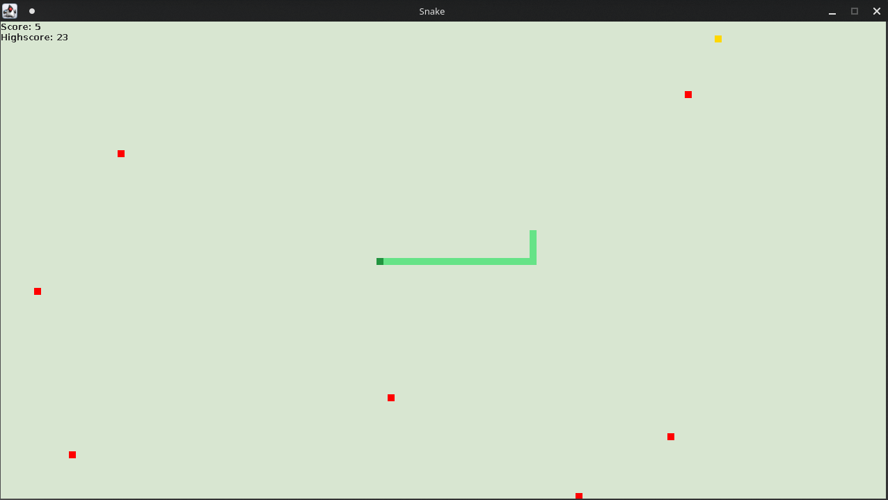

# Snake
A basic snake game written in Java.

## Instructions
Use the arrow keys (`↑`, `→`, `↓`, `←`) to move the snake. Eat apples to gain points and to grow. If you bite your tail, it's game over. 

## Running the application
Make sure you are able to run `javac` and `java`. You don't need any external libraries.
1. clone this repository 
2. `$ cd snake/src`
3. `$ javac game/Main.java`
4. `$ java game/Main`

## Screenshot

